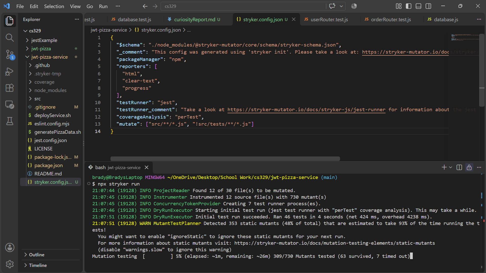
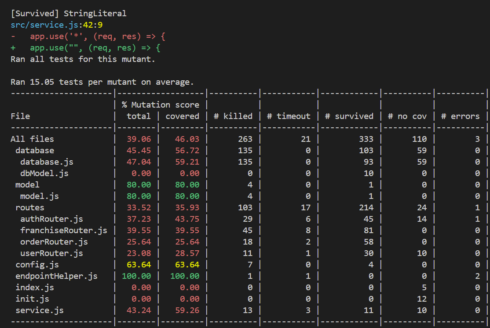

# Curiosity Report: Mutant Testing

## What Is Mutant testing and why I found it interesting

My work uses mutant testing and I was curious to find out more and if I could implement it in my own projects. Basically find out how hard it is to set up and how similar the experience would be compared to what I'm used to at work. The basic idea is introducing bugs intentionally and expecting your tests to fail with those bugs confirming the tests are good. I'll explain more in my research section.

## What I did to research Mutants

I had ChatGPT suggest some articles and read up on what it was, how it's being used in industry, and evidence from research to tell me how well it works at scale.

1. "Mutation testing introduces changes to your code, then runs your unit tests against the changed code. It is expected that your unit tests will now fail. If they don't fail, it might indicate your tests do not sufficiently cover the code." This is the first article I read from the website "https://stryker-mutator.io/docs/" which did a great job explaining it. Mostly matched what I understood already so I assume it will look pretty similar to what I use.

I'm going to explain this in depth because I think it's cool. Here is an example from the article about letting people into a casino.

```rust
fn isUserOldEnough(user) {
  return user.age >= 18;
}
```

Now the mutants will change the sign to see if the tests still work.

```rust
/* 1 */ return user.age > 18;
/* 2 */ return user.age < 18;
/* 3 */ return false;
/* 4 */ return true;
```

Imagine you have only 1 test that tries the age 20. The test expects to return true and the developer is proud to have 100% coverage. But you would also pass that test under the 1st mutant which only tests > 18 and even if it was the 4th mutant that only returns true every time you still pass! D: This isn't saying your code is bad but rather your test is. If an intern down the line were to change the code to one of those passing mutants, they would still be passing all the tests and no one would know they just broke everything. Hopfully the pipeline catches it or that may just end up in production!

2. The next article was on this website "https://www.googblogs.com/mutation-testing/" where I learned about how mutants were being used at Google. They brought up a good point that not all mutants are useful to "kill." My work kind of obsesses over very high coverage and mutant testing which is very robust and for very important productions, maybe necessary. But this is saying many even very large companies don't have high value in heavy mutant testing. They call trivial mutants "unproductive mutants." Another comlpaint they had was that you can't see all the mutants when the project stats to get real big. In our own isolated project mutants was getting rediculously long to run as we added math and comparison heavy files. Perhaps in even larger products it starts to become questionable. 

3. An official google research paper "https://research.google/pubs/practical-mutation-testing-at-scale-a-view-from-google/" described their situation this way "Google has a codebase of two billion lines of code and more than 150,000,000 tests are executed on a daily basis. The traditional approach to mutation testing does not scale to such an environment; even existing solutions to speed up mutation analysis are insufficient to make it computationally feasible at such a scale." The way they said they combat this is (1) it's only applied to changed code, (2) they limit the number of mutants per line, and (3) selected mutant types based on historical performance. Their stratagy used by thousands of projects and developers creates orders of magnitude less mutants while improving quality and actionabiliy. Further they propose it's scalable to any size project! Pretty wild.

## Experiment I conducted (with reproduction path)

I decided to run mutatnts on our jwt-pizza project. I wasn't going to go through and solve all of them but I wanted to run in and evaluate why they were surviving. Here are the steps for how this can be reproduced:

1. In the directory where you run your tests so jwt-pizza-service run this "npm install --save-dev @stryker-mutator/core @stryker-mutator/jest-runner"

2. Next, in the same place run this "npx stryker init" and select the options that make sense for the project (jest, js etc.)

3. Now, open the new stryker.config.mjs and add this on the bottom (before the bracket close)

```js
mutate": ["src/**/*.js", "!src/tests/**/*.js"]
```

4. Finally to use run "npx stryker run"

The following is what it looked like running:



And this is what it looked like when it finished



Here's an example of a surviving mutant. In src/service.js, the error handler returns the error message and stack:

```js
res.status(err.statusCode ?? 500).json({
  message: err.message,
  stack: err.stack
});
```

Stryker changed the response body to an empty object:

```js
res.status(err.statusCode ?? 500).json({});
```

Why Did the Mutant Survive? The mutant survived because the existing tests apparently did not verify the contents of the error response. A test might check that the server returns the expected HTTP status code without checking whether the response contains the error message and stack. Both versions could pass those tests, even though the mutated version removes useful error information from the response. This example shows that executing error-handling code does not necessarily mean that its good enough. 

## What I learned

This was SOOOOOOOO much fun to learn about. I honestly thought it would be a lot harder to get mutants set up and I thought it would be really tricky to work with in java script (I had only ever done it in rust). I was suprised to learn that there is great support for it and I could actually start using this tool if I want. That being said, I also learned about it's short commings, for example our project is fairly small and it took like almost 10 minutes to run. There would certainly be more to do to make this effective.
